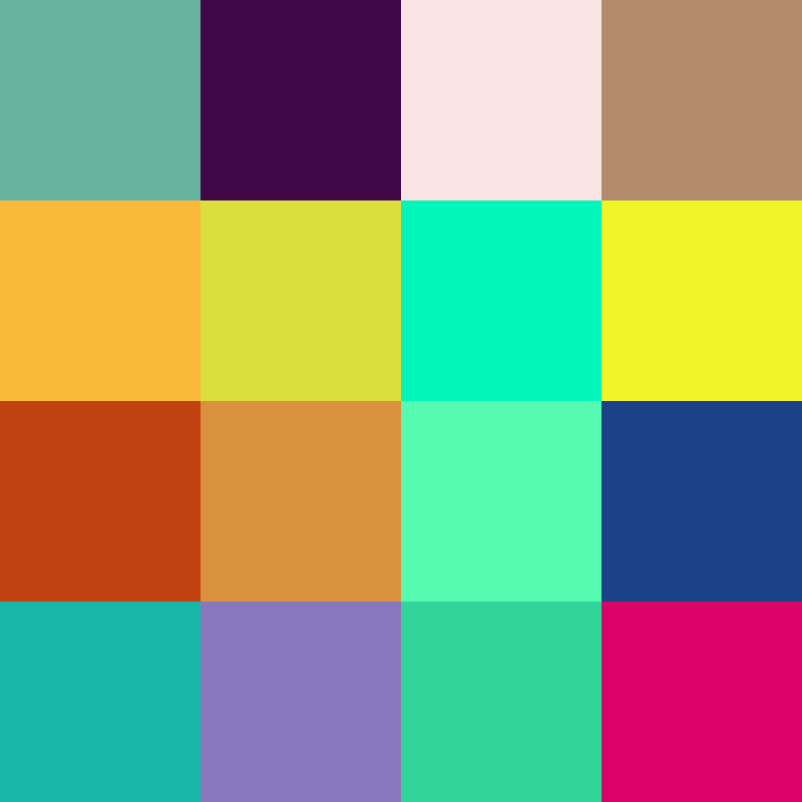

```
Enter a number: 27
SHA384 Hash: 9fb368480841e3e4fa6b8bb13ab9fb3ddedcb9f60229f5f01042bf3e92dab1fb5488411ba8b718be778999d5326702da
Hash divided into 16 parts: ['9fb368', '480841', 'e3e4fa', '6b8bb1', '3ab9fb', '3ddedc', 'b9f602', '29f5f0', '1042bf', '3e92da', 'b1fb54', '88411b', 'a8b718', 'be7789', '99d532', '6702da']
RGB Color Codes: [(159, 179, 104), (72, 8, 65), (227, 228, 250), (107, 139, 177), (58, 185, 251), (61, 222, 220), (185, 246, 2), (41, 245, 240), (16, 66, 191), (62, 146, 218), (177, 251, 84), (136, 65, 27), (168, 183, 24), (190, 119, 137), (153, 213, 50), (103, 2, 218)]
Image saved as 'output_image.png'.
```

